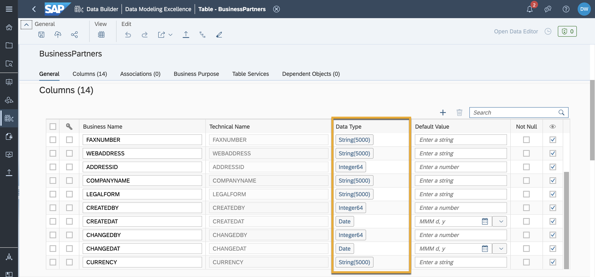
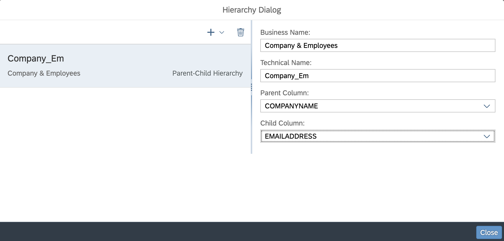

## Prerequisites
 - You have [familiarized yourself with the SAP Data Warehouse Cloud overview and architecture](data-warehouse-cloud-2-interface).
 - You have imported your dataset into the data builder.

## Details
### You will learn
  - How to create a parent-child hierarchy in SAP Data Warehouse Cloud

---

[ACCORDION-BEGIN [Step 1: ](What is a parent-child hierarchy)]

A parent-child hierarchy (PCH) is a hierarchy in a standard dimension that contains a parent attribute. A parent attribute describes a self-referencing relationship, or self-join, within a dimension main table. In other words, child and parent tables are just normal database tables, but they are linked in a way that describes a special relationship: a parent-child relationship. This is used most often when one table's value refers to the value in another table (usually a primary key of another table).

For instance, most profit and loss statements have a native parent-child hierarchy for representing the list of accounts. Also, a list of components of a product, a car for instance, usually is a native parent-child hierarchy because each component has other sub-components, with different levels of depth in different branches of the hierarchy. And, of course, organizational structures of companies, are often represented as parent-child hierarchies, as well.

One of the limitations of a parent-child hierarchies is that each node (item, name, etc.) must have a single parent. Complex organisations, of course, don't respect this constraint and require more complex graphs. Mapping these graphs to a parent-child hierarchy has to be proceeded by the normalisation to a regular organisation tree.

A few constraints of a parent-child hierarchy include:

•	A dimension containing a parent-child hierarchy cannot include any other hierarchies.

•	The attributes used for the parent key and member key cannot be composite keys.

•	If the imported data source contains hierarchy members with multiple parents, you can use surrogate keys in the data source to overcome this issue.

[DONE]
[ACCORDION-END]

[ACCORDION-BEGIN [Step 2: ](Create a parent-child hierarchy)]

1. In order to create a hierarchy within your dataset, you need to ensure that your uploaded CSV files have their datasets defined properly. Go into the **Data Builder**, and select your uploaded CSV file. Ensure that the data types of your target columns are of the right type.

    

2. The next step is defining your table as a dimension. A dimension is where you identify a set of master data attributes and keys for use in fact and consumption models. Hence, your table must be defined as such. On the same screen, click on the **Semantic Usage** drop down and select **Dimension**.

    

3. A hierarchy icon shaped like a staircase now becomes selectable on the top bar. Click on this icon to open the hierarchy settings.

    

4. Click on the + icon and select **Parent-child** hierarchy.

    !

5. You can now define the business name, technical name as well as the parent and child in your parent-child hierarchy. In this example, the parent column is given as the company, and the child column is given as the email address of the employee. Click on **Close** once done.

    !

6. As always, first save and then deploy your dataset. Your dataset is now ready to be combined with analytical datasets to produce a clear and concise visualisation with well defined hierarchies.

    

>**Well done!**

> You have completed the 1st tutorial of this group! Now you know how to create a parent-child hierarchy in SAP Data Warehouse Cloud.

> Learn in the next tutorial [how to create a level-based hierarchy in SAP Data Warehouse Cloud.](data-warehouse-cloud-parent-child-hierarchies)

[DONE]
[ACCORDION-END]

[ACCORDION-BEGIN [Step 3: ](Test yourself)]

[VALIDATE_1]
[ACCORDION-END]

---
